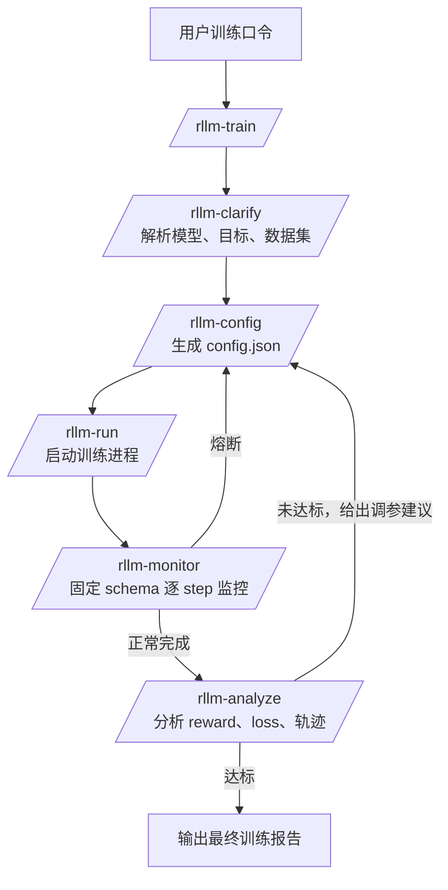
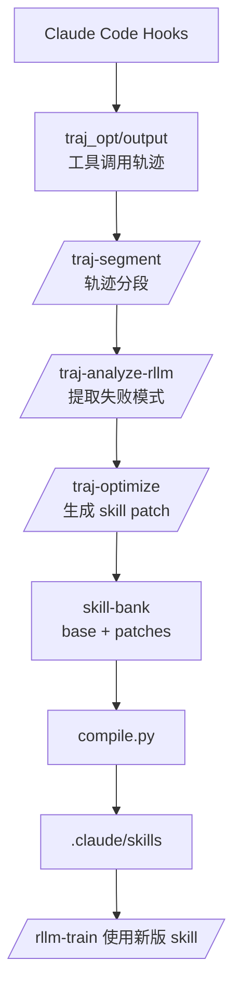
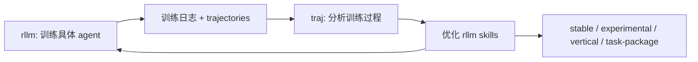

# Agent4AgenticRL Skill

这是从 AgentSDK / Agent Evolution 项目中拆出来的 Claude Code skill 工作包，包含：

- `rllm-*`：启动、配置、监控、分析 agent RL 训练
- `traj-*`：采集 Claude Code 轨迹、分段、分析并优化 skill
- `skill-bank/`：skill 源码、patch、编译、package 管理系统
- `rllm_train/`：本地 HuggingFace/TRL 风格训练运行时
- `traj_opt/`：轨迹采集、分析、patch 生成运行时
- `.claude/skills/`：已编译好的 Claude Code slash skills
- `.claude/settings.json`：Claude Code hooks 配置，用于记录工具调用轨迹

## 推荐目录结构

```text
.
├── .claude/
│   ├── skills/              # Claude Code 已编译 skills
│   └── settings.json        # hooks: PostToolUse / Stop / SubagentStop
├── skill-bank/              # skill 源码、patch、package、编译器
├── rllm_train/              # 本地训练运行时
├── traj_opt/                # 轨迹采集与优化运行时
├── docs/                    # 架构与设计文档
├── skill_bank_paths.py      # 统一路径解析
├── CLAUDE.md                # Claude Code 项目说明
└── requirements_gpu.txt     # GPU/训练相关依赖参考
```

## 快速开始

### 1. 克隆仓库

```bash
git clone https://github.com/Codekiing/Agent4AgenticRL-Skill.git
cd Agent4AgenticRL-Skill
```

### 2. 安装依赖

建议使用 Python 3.10+ 虚拟环境：

```bash
python -m venv .venv
source .venv/bin/activate
pip install -r requirements_gpu.txt
```

`requirements_gpu.txt` 偏 GPU/VERL/TRL 训练环境，依赖较重。如果只想浏览或编译 skill，不需要安装全部训练依赖。

### 3. 检查 skill-bank

```bash
python skill-bank/compile.py --status
python skill-bank/compile.py --validate
python skill-bank/compile.py --list-packages
```

重新编译所有 skills：

```bash
python skill-bank/compile.py --all
```

编译结果会写入：

```text
.claude/skills/<skill-name>/SKILL.md
```

### 4. 在 Claude Code 中使用

在仓库根目录启动 Claude Code 后，可以使用：

```text
/rllm-train 用 qwen-7b 训练一个数学 agent，reward >= 0.7，数据集用 deepscaler
```

如果数据集路径尚未在口令中写明，`rllm-clarify` 会继续追问本地 DeepScaler 数据集目录。也可以直接把路径写进一句话里：

```text
/rllm-train 用 qwen-7b 训练一个数学 agent，reward >= 0.7，数据集用 deepscaler，路径是 /path/to/deepscaler
```

当前 `rllm-clarify` 要求提供真实数据集路径。数据集应是 HuggingFace Dataset 格式目录，通常包含：

```text
data-00000-of-00001.arrow
dataset_info.json
state.json
```

且样本字段中应包含：

```text
problem 或 question
answer
```

## 常用 skills

### 训练侧：`rllm-*`

| Skill | 作用 |
|---|---|
| `/rllm-train` | 端到端训练编排：需求澄清 → 配置 → 启动 → 监控 → 分析 → 调参 |
| `/rllm-clarify` | 从自然语言中提取训练需求 |
| `/rllm-config` | 生成或调参训练配置 |
| `/rllm-run` | 启动本地训练进程 |
| `/rllm-monitor` | 主动轮询训练日志，固定 schema 输出每 step 指标 |
| `/rllm-analyze` | 分析训练结果和轨迹 |

### 轨迹优化侧：`traj-*`

| Skill | 作用 |
|---|---|
| `/traj-setup` | 初始化轨迹采集/优化环境 |
| `/traj-status` | 查看轨迹采集状态 |
| `/traj-segment` | 将轨迹切分为 skill/free segments |
| `/traj-analyze-rllm` | 分析 rllm 训练相关轨迹 |
| `/traj-optimize` | 根据轨迹分析生成 skill patch |
| `/traj-loop` | 多轮训练-分析-优化闭环 |
| `/traj-train-optimize` | 对某一轮训练结果执行优化 |

## Skill 运行流图

### rllm 训练流



### traj 技能优化流



### 双层闭环



## Monitor 固定输出格式

`/rllm-monitor` 已统一每 step 输出 schema，缺失字段用 `—`：

```text
Step X/Y | R Z.ZZZ | Rstd Z.ZZZ | Loss L.LLLL | Grad G.GGGG | Ent E.EEEE | Clip C.CC | Len N | Finish P% | FmtOK P% | Tool P% | Ans P% | tok/s T.T | Time S.Ss | ETA ~Mm | Status OK/WARN/STOP
```

其中：

| 字段 | 含义 |
|---|---|
| `R` | 平均 reward |
| `Rstd` | 同 step 内 reward 标准差 |
| `Loss` | policy loss |
| `Grad` | grad norm |
| `Ent` | entropy |
| `Clip` | clipped ratio |
| `Len` | 平均 completion 长度 |
| `Finish` | 调用 finish 的比例 |
| `FmtOK` | finish 参数格式正确比例 |
| `Tool` | 使用 calculate 的比例 |
| `Ans` | 输出中含可解析数字答案的比例 |
| `Status` | 当前 step 状态，例如 `OK`、`WARN(length-limit)`、`STOP(length-limit)` |

长度/截断硬规则：

```text
Clip >= 0.80
或
Len >= max_completion_length * 0.90
```

连续 2 个已完成 step 命中时显示：

```text
WARN(length-limit)
```

连续 3 个已完成 step 命中时触发：

```text
STOP(length-limit)
fix_preset = increase_max_completion_length
```

## Skill-bank 使用方式

`skill-bank/` 是源码与 patch 系统，不建议直接改 `.claude/skills/*/SKILL.md`。

推荐流程：

1. 修改 `skill-bank/<group>/<skill>/base.md` 或 `patches/*.md`
2. 重新编译：

```bash
python skill-bank/compile.py <skill-name>
```

3. 查看 diff：

```bash
python skill-bank/compile.py --diff <skill-name>
```

4. 验证 registry/package：

```bash
python skill-bank/compile.py --validate
python skill-bank/compile.py --list-packages
```

## Skill package layer

当前 package layer 位于：

```text
skill-bank/packages/
```

包含：

| 类型 | 说明 |
|---|---|
| `stable/` | 通用稳定 skill 基座 |
| `experimental/` | 面向新任务/新领域的实验包 |
| `vertical/` | 已验证的垂类 skill 包 |
| `task-packages/` | 单个具体训练任务的可复现包 |
| `lineage-archive/` | 多轮演化过程归档 |

新任务默认优先使用：

1. 匹配的 `vertical.current`
2. 否则使用 `stable.current`

不要默认使用 `task-packages/` 或 `lineage-archive/`，除非目标是复现历史任务。

## Hooks 与轨迹采集

`.claude/settings.json` 启用了 hooks：

```json
{
  "PostToolUse": "python traj_opt/hooks/post_tool.py",
  "Stop": "python traj_opt/hooks/on_stop.py",
  "SubagentStop": "python traj_opt/hooks/on_stop.py --subagent"
}
```

运行 Claude Code 时，工具调用轨迹会写入：

```text
traj_opt/output/
```

该目录是运行时生成物，不会提交到仓库。

## 维护建议

- 修改 skill 时，优先改 `skill-bank/` 源文件，再编译到 `.claude/skills/`
- 每次训练后不要提交 `rllm_train/output/`
- 每次轨迹优化后不要提交 `traj_opt/output/`
- 如果某个任务经验值得长期复用，应归档到 `skill-bank/packages/task-packages/` 或晋升到 `vertical/`
