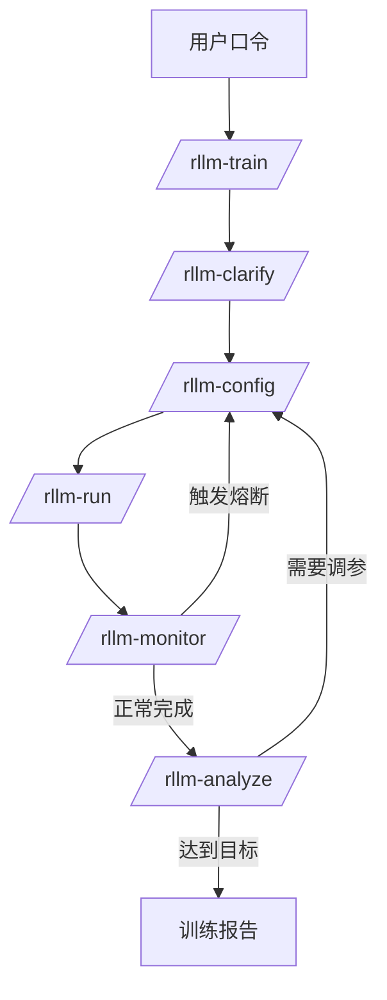
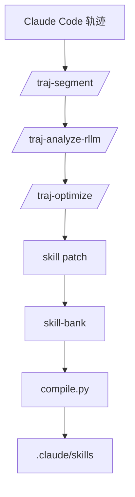
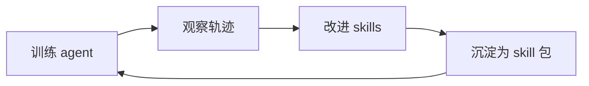

# Agent4AgenticRL Skill

Agent4AgenticRL Skill 是一组面向 Claude Code 的 Agentic RL 工作流 skills。它把训练、监控、分析和 skill 自优化组织成可复用的 slash commands，让用户可以用自然语言驱动 agent 训练，并把训练过程中的经验沉淀为可复用的 skill 包。

## 项目定位

这个仓库是一个 Claude Code skill 项目，重点不是介绍后端训练框架，而是提供一套可复用的工作流命令。

它主要解决三件事：

1. **用自然语言启动训练任务**：用户通过 `/rllm-train` 描述目标、模型和数据集。
2. **用统一流程监控与调参**：skills 负责编排配置、启动、逐步监控、异常熔断和结果分析。
3. **用轨迹优化 skills**：训练和交互过程会被转化为可分析的轨迹，用于改进下一轮 skill 行为。

## Skills 列表

### 训练侧 skills

| Skill | 作用 |
|---|---|
| `/rllm-train` | 端到端训练入口：解析需求、生成配置、启动训练、监控、分析和调参 |
| `/rllm-clarify` | 从用户自然语言中提取训练需求 |
| `/rllm-config` | 生成初始训练配置，或根据分析结果调参 |
| `/rllm-run` | 启动一次训练任务 |
| `/rllm-monitor` | 按固定 step schema 监控训练过程，并在异常时触发熔断 |
| `/rllm-analyze` | 分析训练结果、失败模式和下一轮建议 |

### 轨迹优化侧 skills

| Skill | 作用 |
|---|---|
| `/traj-setup` | 初始化轨迹采集和优化环境 |
| `/traj-status` | 查看轨迹采集与优化状态 |
| `/traj-segment` | 将 Claude Code 轨迹切分为 skill 相关片段 |
| `/traj-analyze-rllm` | 分析训练相关轨迹，提取失败模式和改进点 |
| `/traj-optimize` | 根据分析结果生成 skill patch |
| `/traj-loop` | 执行训练、轨迹分析、skill 优化的多轮闭环 |
| `/traj-train-optimize` | 针对某一轮训练结果执行优化 |

## 快速开始

克隆仓库后，在仓库根目录打开 Claude Code。

```bash
git clone https://github.com/Codekiing/Agent4AgenticRL-Skill.git
cd Agent4AgenticRL-Skill
claude
```

在 Claude Code 中直接使用 slash command：

```text
/rllm-train 用 qwen-7b 训练一个数学 agent，reward >= 0.7，数据集用 deepscaler
```

如果需要指定本地数据集路径，可以写成：

```text
/rllm-train 用 qwen-7b 训练一个数学 agent，reward >= 0.7，数据集用 deepscaler，路径是 /path/to/deepscaler
```

也可以先查看或验证 skill-bank：

```bash
python skill-bank/compile.py --status
python skill-bank/compile.py --validate
python skill-bank/compile.py --list-packages
```

## 工作流

### 训练流



### Skill 优化流



### 双层闭环



## Monitor 输出格式

`/rllm-monitor` 使用固定 step schema。每一步都按同一格式输出，缺失字段用 `—`：

```text
Step X/Y | R Z.ZZZ | Rstd Z.ZZZ | Loss L.LLLL | Grad G.GGGG | Ent E.EEEE | Clip C.CC | Len N | Finish P% | FmtOK P% | Tool P% | Ans P% | tok/s T.T | Time S.Ss | ETA ~Mm | Status OK/WARN/STOP
```

核心字段：

| 字段 | 含义 |
|---|---|
| `R` | 平均 reward |
| `Rstd` | 当前 step 内 reward 标准差 |
| `Loss` | 策略损失 |
| `Grad` | 梯度范数 |
| `Ent` | 策略熵 |
| `Clip` | 截断比例 |
| `Len` | 平均 completion 长度 |
| `Finish` | finish 调用比例 |
| `FmtOK` | finish 参数格式正确比例 |
| `Tool` | 工具调用比例 |
| `Ans` | 可解析答案覆盖率 |
| `Status` | 当前 step 状态，例如 `OK`、`WARN(length-limit)` 或 `STOP(length-limit)` |

## Skill 包

`skill-bank/packages/` 用于管理 skill 的不同生命周期形态：

| 包类型 | 含义 |
|---|---|
| `stable` | 通用稳定 skill 基座 |
| `experimental` | 面向新任务或新领域的实验包 |
| `vertical` | 已验证的垂类 skill 包 |
| `task-packages` | 某个具体训练任务的可复现包 |
| `lineage-archive` | 多轮 skill 演化过程归档 |

推荐流转方式：

```text
stable → experimental/<domain> → vertical/<domain>
       ↘ task-packages / lineage-archive
```

## 自定义 skills

不要直接修改 `.claude/skills/*/SKILL.md`。这些文件是编译产物。

推荐流程：

1. 修改 `skill-bank/<group>/<skill>/base.md` 或 `skill-bank/<group>/<skill>/patches/*.md`
2. 预览差异：

```bash
python skill-bank/compile.py --diff <skill-name>
```

3. 编译 skill：

```bash
python skill-bank/compile.py <skill-name>
```

4. 验证 package 和路径约束：

```bash
python skill-bank/compile.py --validate
```

## 目录结构

```text
.
├── .claude/skills/        # 已编译的 Claude Code skills
├── skill-bank/            # skill 源文件、patch、编译器和 skill 包
├── docs/                  # 设计文档
├── rllm_train/            # 训练侧 skill 支撑代码
├── traj_opt/              # 轨迹优化侧 skill 支撑代码
└── skill_bank_paths.py    # 统一路径解析
```

## 贡献方式

修改 skill 时：

1. 优先修改 `skill-bank/` 下的源文件
2. 使用 `python skill-bank/compile.py <skill-name>` 重新编译
3. 保持 `.claude/skills/` 中的编译产物同步
4. README 保持聚焦于 skills、命令、工作流和 skill 包
